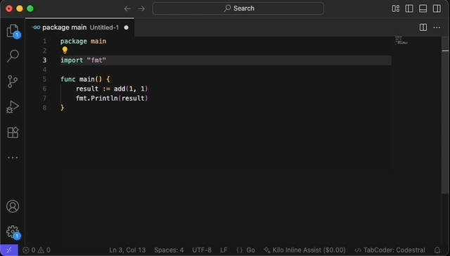

# TabCoder

**AI-driven code suggestions.**

A lean, efficient, and cost-effective VS Code extension that focuses exclusively on **autocomplete**.

## Why TabCoder?

The project began following the removal of KiloCode's experimental autocomplete feature (See [PR #1565](https://github.com/Kilo-Org/kilocode/pull/1565)).
Although it's a complete rewrite from scratch, it draws significant inspiration from that codebase — itself largely influenced by Continue's autocomplete feature.

Several popular tools either dropped or lack support for pure AI-powered autocomplete:

1. **KiloCode** removed support for this feature in [PR #1565](https://github.com/Kilo-Org/kilocode/pull/1565) in favor of Inline Assist, which is great but doesn’t provide real-time suggestions since it must be manually triggered. A new “Auto trigger” option was later added to automatically launch Inline Assist when you stop typing, which can be handy for quick fixes. However, it feels too intrusive for autocomplete use cases, as it displays a diff rather than inline, seamless suggestions.
2. **RooCode** and **Cline** currently don't offer AI-driven autocompletion.
3. **GitHub Copilot Chat** is open-source, but **Copilot's autocomplete** remains proprietary—no custom provider support.
4. **Continue** had a stellar autocomplete feature, but the project's scope includes too many unrelated features.
5. **Supermaven** is awesome and has a free-tier but is closed source.

**TabCoder** exists to fill this niche: pure, focused AI autocompletion under your control.

⚡️ KiloCode for Agentic coding & TabCoder for autocomplete = Lightning fast development ⚡️.

## Features

- ⚡️ Inline AI suggestions accepted with **Tab**
- 🧩 Bring-your-own provider (OpenRouter, OpenAI, Ollama ...)
- 🪶 Lightweight (minimal CPU/memory, minimal UI)
- 🎯 Context-aware suggestions
- 🔐 Your credentials are securely stored in VSCode's secure storage

That's it. No chat, no agents, no distractions.

## Setup & Configuration

### First Time Setup

1. **Create an AI Profile**: Open the Command Palette (`Ctrl+Shift+P` / `Cmd+Shift+P`) and run:
   - `TabCoder: Create New AI Profile`
   - Choose your AI provider (OpenAI, OpenRouter, Ollama, etc.)
   - Enter your API endpoint and key
   - Select a model from the available options (Codestral and Gemini 2.5 flash are good options)
   - Give your profile a memorable name

2. **Activate Your Profile**:
   - `TabCoder: Switch Active Profile`
   - Select the profile you want to use for completions

### Managing Profiles

- **Create Profile**: `TabCoder: Create New AI Profile` - Set up a new AI provider configuration
- **Switch Profile**: `TabCoder: Switch Active Profile` - Change which profile is active or disable TabCoder
- **Delete Profile**: `TabCoder: Delete Profile` - Remove a profile permanently

### Keyboard Shortcuts

- `Tab` - Accept AI suggestion while typing

## Usage

Once configured:
- Start typing and watch inline AI suggestions appear
- Press **Tab** to accept the current suggestion
- The status bar shows your active profile and connection status

## Roadmap

- Smarter completions with LSP integration
- Cost/usage reporting (when available on the provider)
- More providers
- Configure excluded files (eg. `.env` files)

If you want something added **only if it serves autocomplete**, open an issue.

## License

Apache License Version 2.0. [See LICENSE for more information](https://github.com/alexandrevilain/tabcoder/blob/main/LICENSE).

## Acknowledgements

Thanks to the communities behind KiloCode, RooCode, Cline, Continue, and the broader VS Code ecosystem. Their work helped shape this project's direction.
